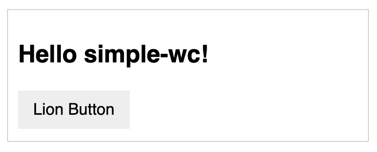

# `<simple-wc>`


> Project manually forked from from https://github.com/jdvivar/lit-in-polymer2-poc

## Getting started

Just run `start` script and everything will autoinstall and load
```sh
npm start
```

## Why

Polymer 2 HTML ==> JS bundle (non-ES)

Because some stakeholders/owners might need to transform old-super-deprecated (but important!) Polymer 2 Web Components and use them in environments were:
- ES imports are not available, i.e. too old browsers such as IE11
- HTML imports are not available, i.e modern browsers such as Chrome 80

## Structure

- [/simple-wc](/simple-wc)
  
  Holds the web component written in HTML (which by the way uses a LitElement from the @lion repo)

- [/web](/web)

  holds a demo that makes use of the bundle

## General recommendation

Refactor Polymer 2 Web Components and write ES-compatible Web Components instead, such as [LitElement](https://github.com/polymer/lit-element), creating a big fat bundle for non-ES compatible browsers, and ES-compatible modules for modern browsers. For more recommendations regarding Web Components, please check out [open-wc](https://open-wc.org/)